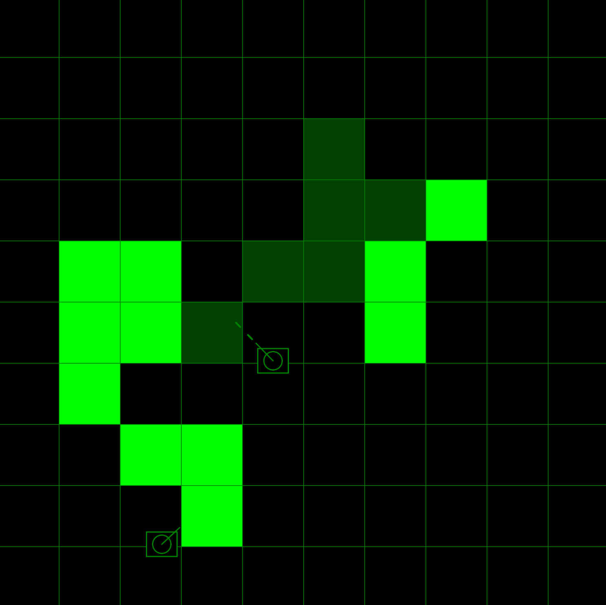
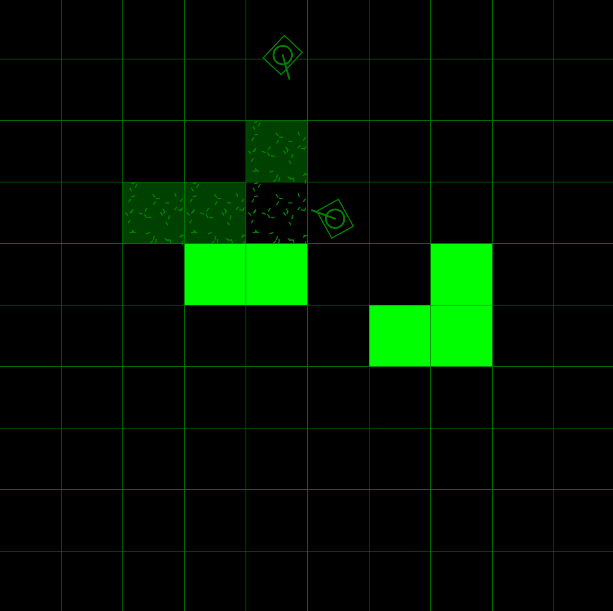
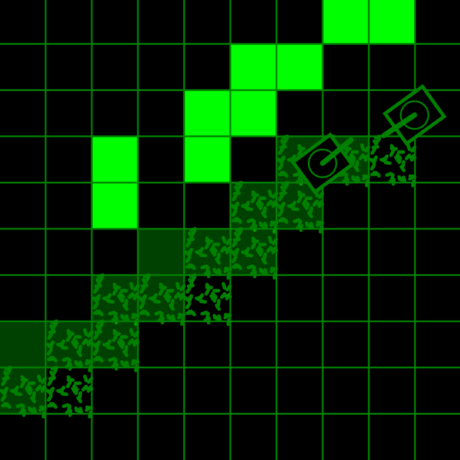

# project-tank 🪖🌱🌻

two tanks growing stuff together on a farm, instead of shooting at each other.

## Controls 🕹️

```
  | Key         | Action           |
  |-------------|------------------|
  | Player 1    |                  |
  | W           | UP               |
  | S           | DOWN             |
  | A           | LEFT             |
  | D           | RIGHT            |
  | V           | Shoot Water      |
  | B           | Tank turret CCW  | 
  | N           | Tank turret CW   |
  |             |                  |
  | Player 2    |                  |
  | ARROW_UP    | UP               |
  | ARROW_UP    | DOWN             |
  | ARROW_LEFT  | LEFT             |
  | ARROW_RIGHT | RIGHT            |
  | NUM_1       | Plant Seeds      |
  | NUM_2       | Tank turret CCW  | 
  | NUM_3       | Tank turret CW   |
```


## Story

While I was at [The Recurse Center](https://recurse.com), folks there bought and set up an arcade cabinet ([RCade](https://rcade.recurse.com)) where anyone could publish their game onto via GitHub.

The arcade had a controls for two players, each getting:
- a joystick
- two buttons
- a spinner

So I first thought of making a tank game, since that could involve all the controls: joystick for tank movement, spinner for turret movement, etc.

This became the intial commit on the main branch of this repo:


Then I thought: Why did I think of a violent game? I should turn this game into something less violent. So I turned tank into a [farm-like game](https://github.com/holistudio/project-tank/tree/farm), where grid cells "grow" into green cells over time:



Then I made player 1's tank shoot out water while player 2's tank plants seeds, turning the competitive game into a [cooperative game](https://github.com/holistudio/project-tank/tree/seed-water-farm):



This is the current state of the game for now. It has also been ported to an [RCade version](https://github.com/holistudio/tank-farm), displayed on a smaller screen.



And it's now live at RCade :)


